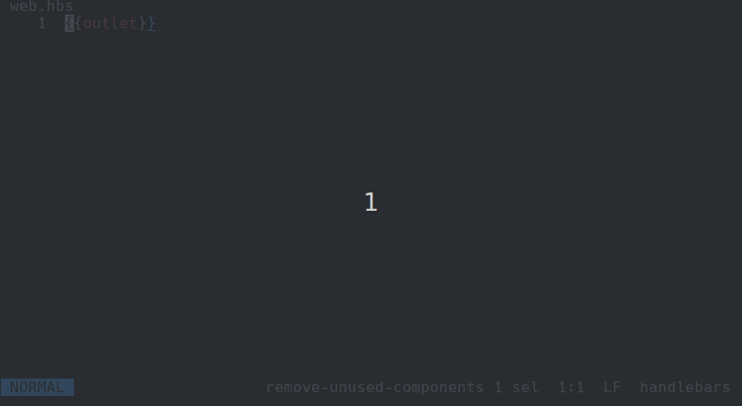

# helix-snippets-ls

[](https://npmjs.org/package/helix-snippets-ls 'View this project on npm')

Language server for snippets in Helix

This package allows you to add snippets to the [Helix](https://helix-editor.com) editor
using a LSP server for autocompleting snippets.

You can define your snippets in a TOML file and use it in Helix.




## Install
```
npm i -g helix-snippets-ls
```


### Usage
Create an `snippets.toml` file inside your Helix config dir `~/.config/helix/snippets.toml`

The snippets follow the [VSCode snippets](https://code.visualstudio.com/docs/editor/userdefinedsnippets) standard.
Add snippets inside it like:

```toml
li = "<li>$0</li>"
img = ""
inbx = "<AppInbox abc=\"$1\" xyz=\"$2\">$0</AppInbox>"

# Multiline snippets
for = """for await (const ${1:iterator} of ${2:object}) {
      \t$0
      }"""
sim = "setImmediate(() => {\n\t${0}\n})"

```

### Config
Config your `languages.toml` to use this Language server

```toml
[[language]]
name = "handlebars"
roots = ["package.json"]
file-types = ["hbs"]
scope = "source.hbs"
language-server = { command = "helix-snippets-ls" } 
```

### Known limitations
- The language server can be only used for one language at a time
